# Data-Manager-MySQL-SQLite-JSON

## Опис

DBD (Database Management Tool) — це веб-додаток, який дозволяє керувати базами даних у форматах JSON, MySQL, та SQLite. Програма надає користувачам інтуїтивно зрозумілий інтерфейс для створення, редагування та перегляду баз даних.

## Функціональні можливості

- **JSON:**
  - Створення та видалення JSON-файлів.
  - Додавання, редагування, перегляд записів у JSON-файлі.
- **MySQL:**
  - Створення та видалення таблиць.
  - Додавання, редагування, видалення та перегляд записів.
- **SQLite:**
  - Створення нових баз даних.
  - Робота з таблицями та записами (додавання, редагування, видалення).

## Встановлення

1. Завантажте файли проєкту з репозиторію.
2. Розпакуйте архів до папки на вашому сервері.
3. Налаштуйте конфігураційні файли:
   — Для MySQL: відредагуйте файл `www/mysql/config.php`.
4. Імпортуйте базу даних MySQL, використовуючи файл `dbd.sql`.
5. Запустіть локальний сервер (наприклад, XAMPP або WAMP) і відкрийте додаток у браузері.

## Використання

1. Перейдіть на головну сторінку програми.
2. Виберіть тип бази даних для роботи: JSON, MySQL, SQLite.
3. Використовуйте відповідні функції для управління даними.

## Скріншоти

Головна сторінка

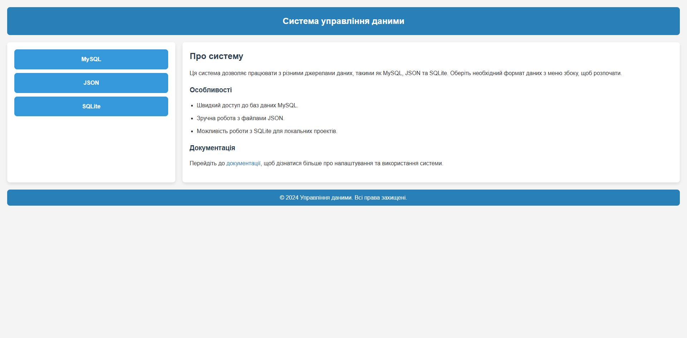

JSON

Створення нового файлу:
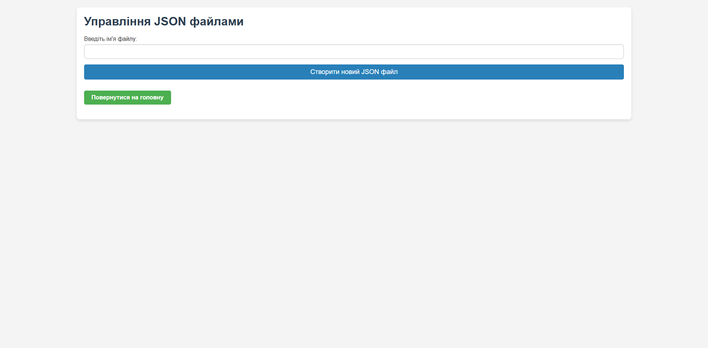

Редагування файлу:
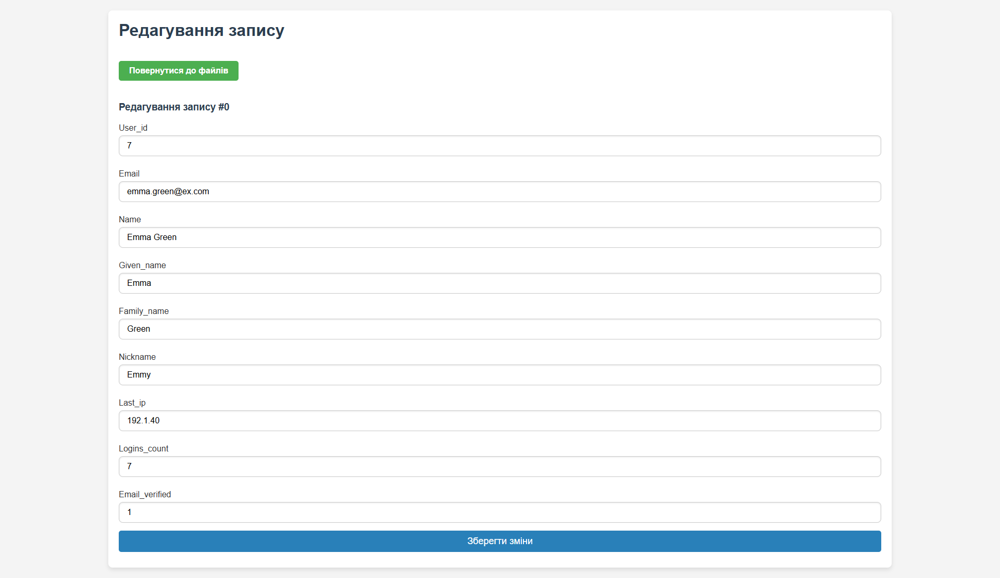

Додавання нового запису:
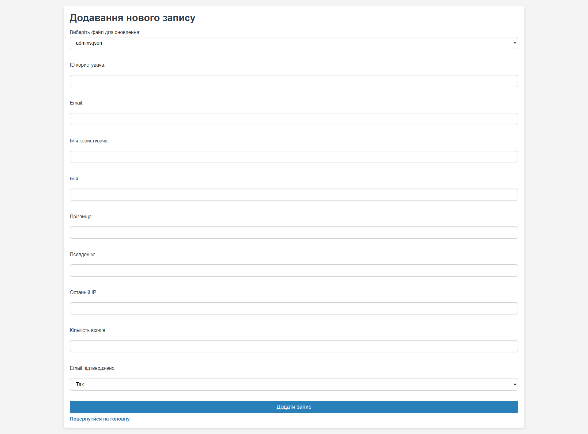

Вибір файлу:
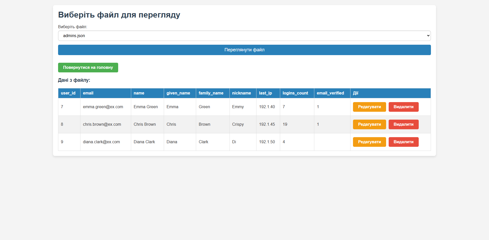

Видалення файлу:
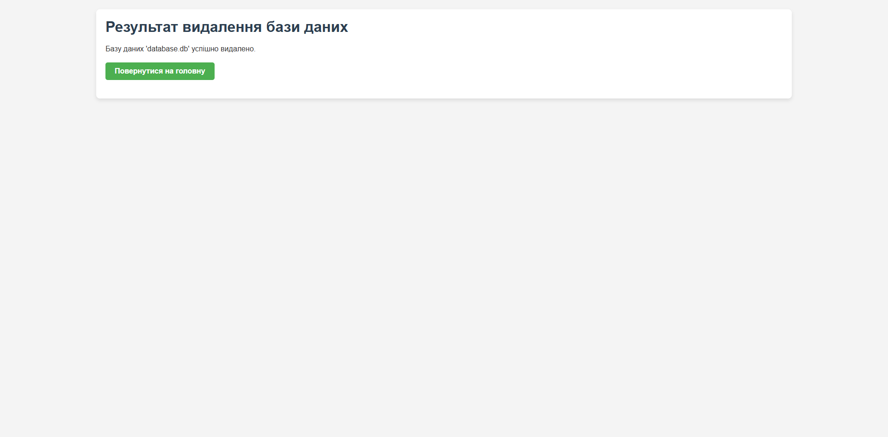

MySQL

Перегляд записів:
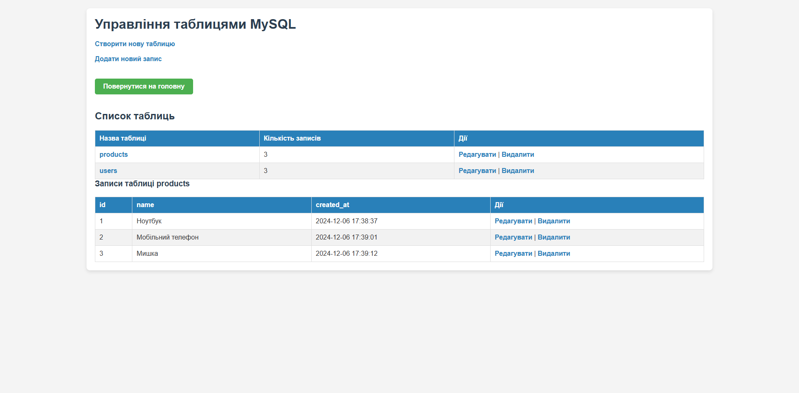

Додавання запису:
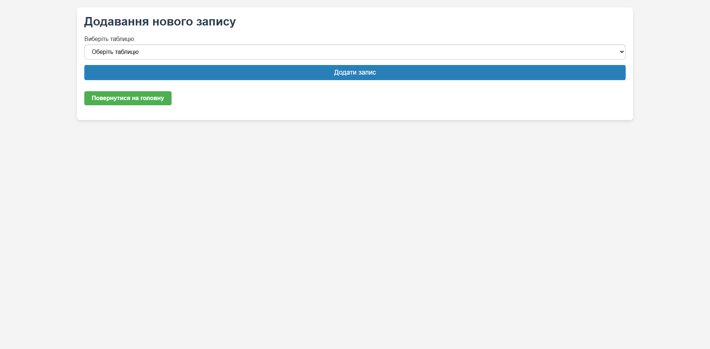

Редагування запису:
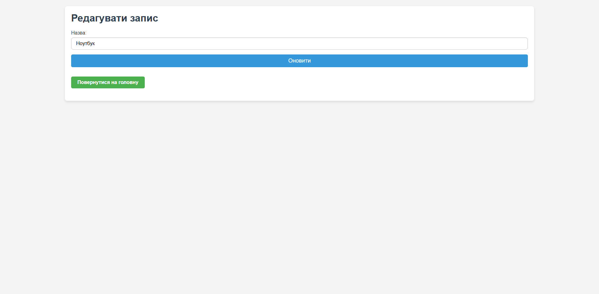

Створення таблиці:
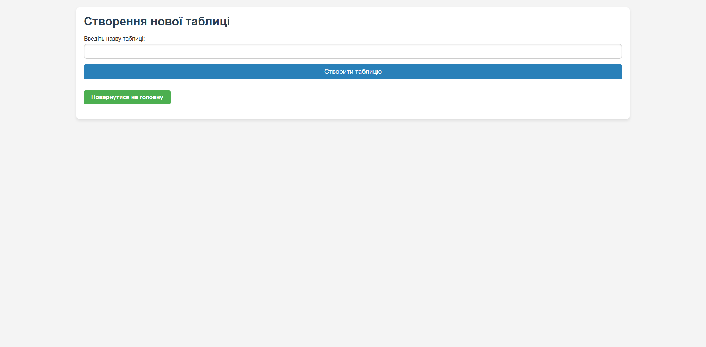

SQLite

Вибір бази даних:
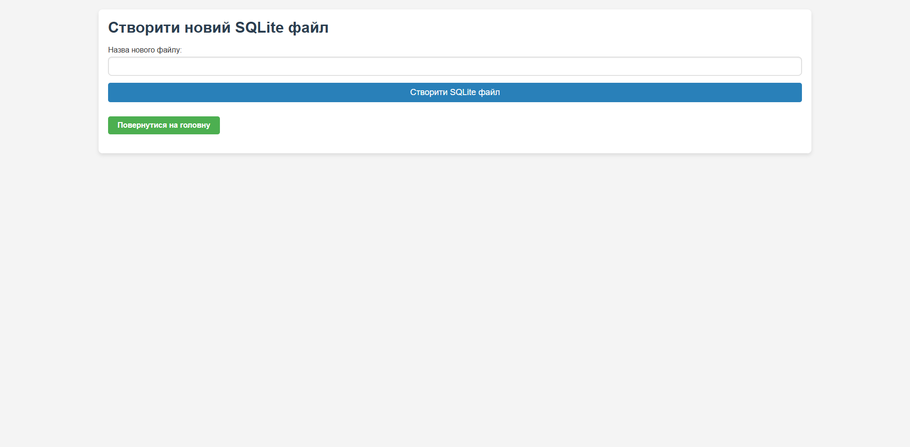

Перегляд запису:
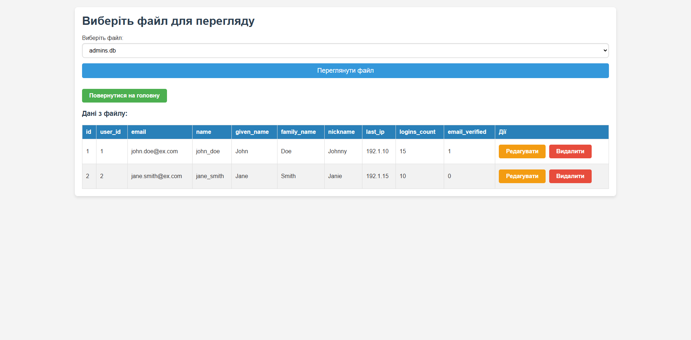

Додавання запису до бази даних:
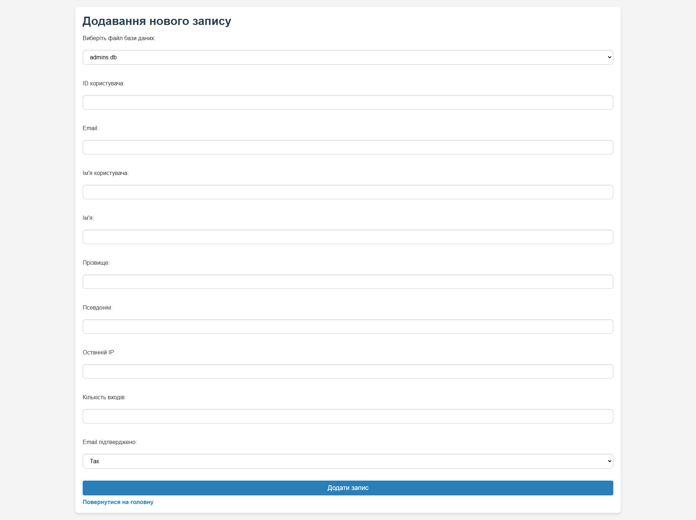

Вибір файлу для редагування:
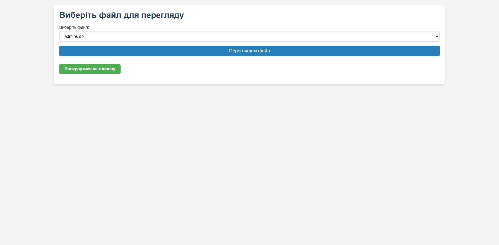

Документація

Частина 1

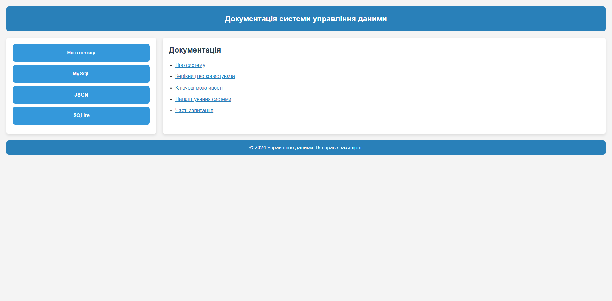

Частина 2

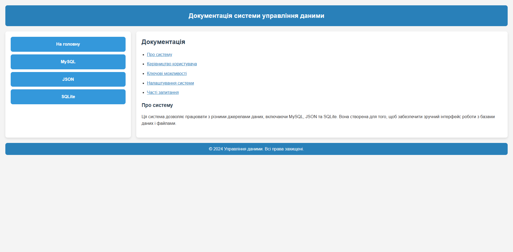

Частина 3

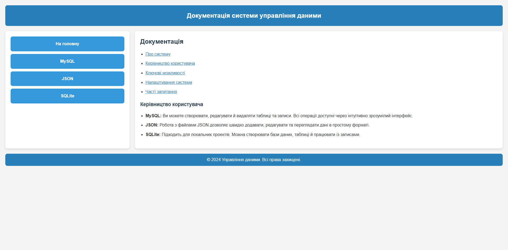

Частина 4

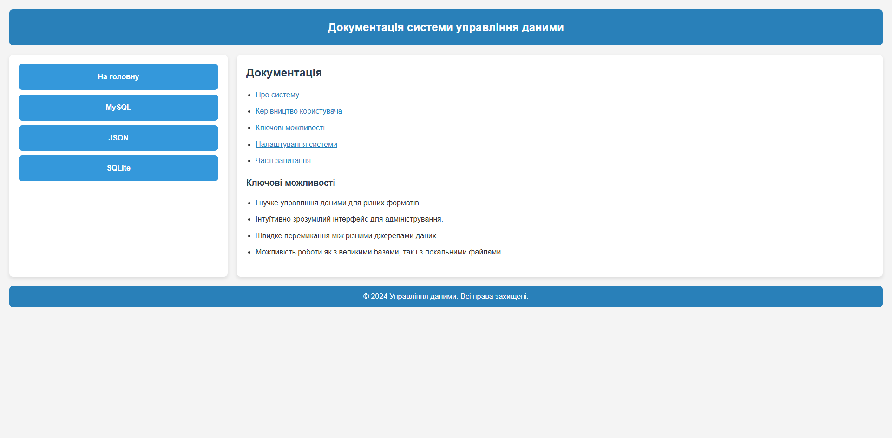

Частина 5

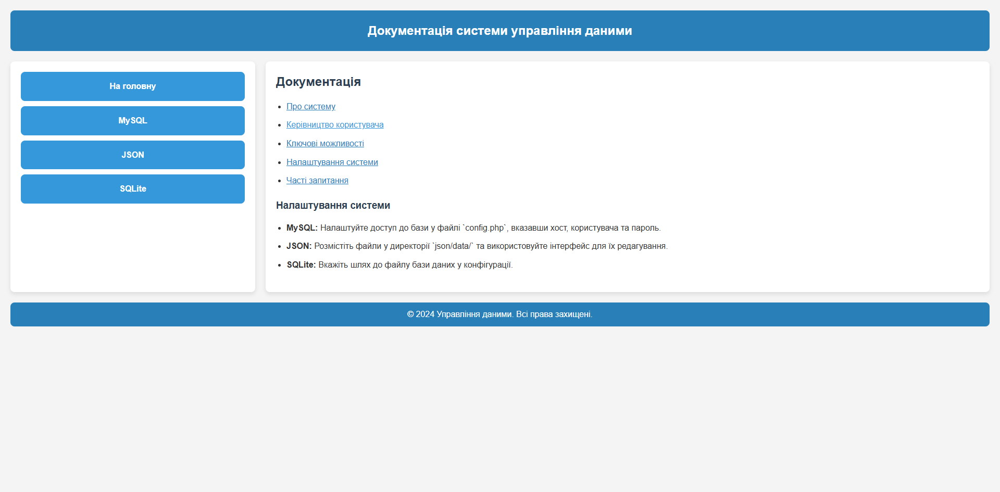

Частина 6

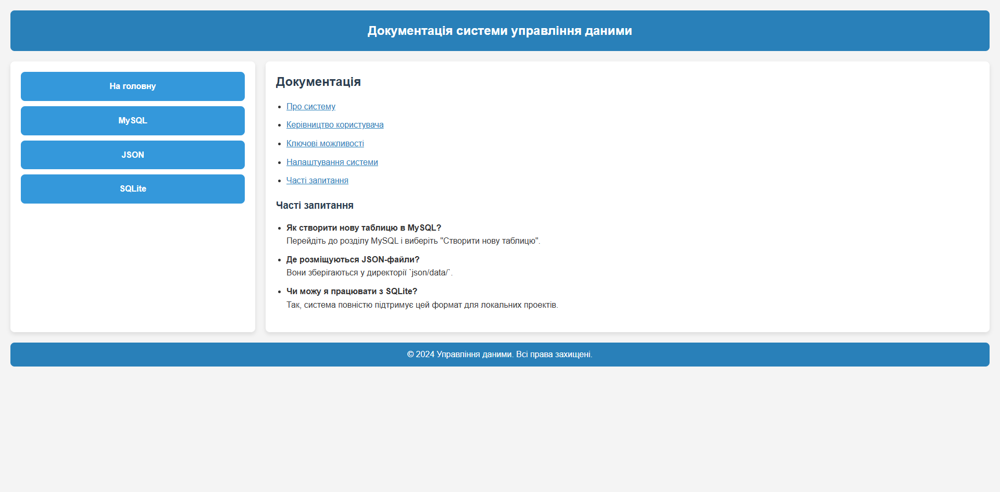
